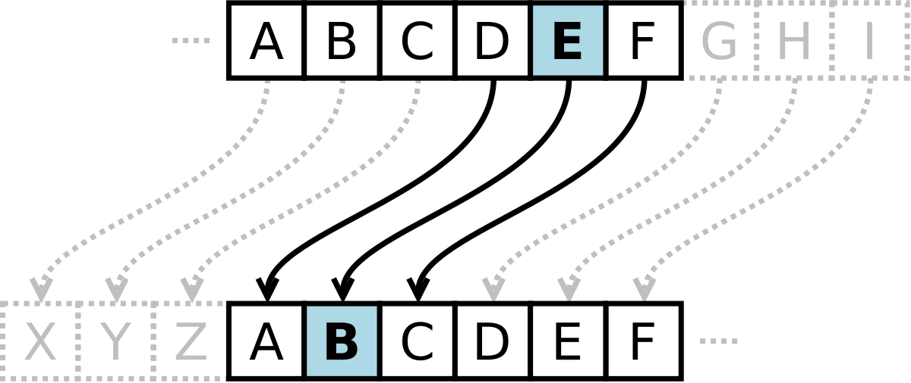

# Caesar Cipher Program in JavaScript
Caesar Cipher is one of the simplest and most used encryption techniques. In this technique, each letter of the given text is replaced by a letter of some fixed number of positions down the alphabet.

For example, with a shift of 1, X would be replaced by Y, and Y would become Z, and so on. Julius Caesar was the first one who used it for communicating with his officials. Based on his name, this techniqe was named as Caesar Cipher technique.

An integer value is required to cipher a given text. the integer value is known as shift, which indicates the number of positions each letter of the text has been moved down.

See the figure below.

We can mathematically represent the encryption of a letter by a shift in the following way:

Encryption phase with shift $` n = E_n (x) = (x + n) mod(26)$`

Decryption phase with shift $` n = D_n (x) = (x - n) mod(26)$`

__Examples__
-
Text: ABCDEFGHIJKLMNOPQRSTUVWXYZ

Shift: 23

Cipher: XYZABCDEFGHIJKLMNOPQRSTUVW

Text: ATTACKATONCE

Shift: 4

Cipher: EXXEGOEXSRGI

Text: DIGITALREGENESYS

Shift: 8

Cipher: 

Text: PYTHONPROGRAMMING

Shift: 6

Cipher:

__Experiment 11:__
-
To encrypt and decrypt the given message by using Caesar Cipher encryption algorithm.

__Algorithms:__
-
1. In Caesar Cipher each letter in the plaintext is replaced by a letter some fixed number of positions down the alphabet.
2. For example, with a left shift of 3, D would be replaced by A, E would become B, and so on.
3. The encryption can also be represented using modular arithmetic by first transforming the letters into numbers according to the scheme, A=0, B=1, Z=25.
4. Encryption of a letter x by shift n can be described mathematically as,
5. $`E_n (x) = (x + n) mod(26)$`
6. Decryption is performed similarly,
7. $`D_n (x) = (x - n) mod(26)$`

---
Daniel Zadva Jnr